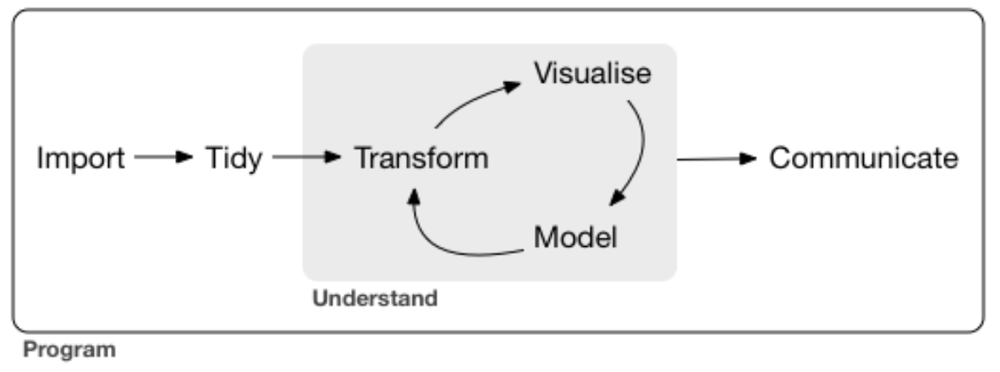

## History
The [tidyverse](https://www.tidyverse.org/packages/) is a set of actively developed and well-maintained R packages to facilitate the typical data analysis workflow. Most but not all of the core tidyverse packages (there are now 8) were designed by Hadley Wickham, chief scientist at R Studio since 2013. His book _[R for Data Science](https://r4ds.had.co.nz/)_ is an incredible resource for all programming levels and will be referenced throughout this tutorial. Plenty of his talks and interviews are available on YouTube; [here's]((https://www.youtube.com/watch?v=9YTNYT1maa4)) my favorite from the VIZBI conference at EMBL last year. 

Many R programmers who don't explicitly know what the tidyverse is have at least used `ggplot2`, and if they got their start in base R as I did, probably found it annoying because of the slightly different syntax. The inspiration behind it was to be the first open source implementation of _[The Grammar of Graphics](https://towardsdatascience.com/a-comprehensive-guide-to-the-grammar-of-graphics-for-effective-visualization-of-multi-dimensional-1f92b4ed4149)_ (hence **gg**plot), a statistical textbook from the 1980s that provided a concise way to describe a range of data visualizations. Grammar is simply an attribute of language that dictates how elements must be expressed in order to be understood, and where human languages predominately evolve the grammar that distinguishes them functionally, programming languages can be tailored and tweaked. The tidyverse is a kind of Esperanto in that regard.

The goal of `ggplot` though - getting from data to visualization more intuitively - is what paved the way for the rest of the tidyverse. R users who have ever melted or reshaped a data frame might be curious to know that those packages were also Hadley's work and key predecessors of the `dplyr` and `tidyr` packages in the current core tidyverse. As he puts it, very often the key to creating a visualization is about getting the data in the right form.


<br>
I like seeing the simple workflow above because it encapsulates my work as a computational scientist and places me firmly in the growing field of data science: regardless of discipline or motivating question, the work starts with data and ends with communicating something learned from the nonlinear process of exploring that data. The tidyverse attracted me because it offered complete workflow coverage and consistency throughout, which felt like the best ways to attain fluency and proficiency. Once I got into it, I realized that the weird syntax that kept me from liking `ggplot2` a few years ago is exactly what gives it those attractive qualities.

## Tidy Philosophy

## Import

We're going to be using data from the COVID Tracking Project in the US. The API is easily accessible, and a woman already created a wrapper package for R to make accessing historical and current statistics incredibly simple.

Calling `library(tidyverse)` will load all the functions we'll need today, except we must also import `magrittr`, which provides us with the pipe (`%>%`) operator and some 'aliases' useful when using chaining syntax.

```{r knitr, include = FALSE}
knitr::opts_chunk$set(message = FALSE, warning = FALSE, linenos = FALSE)
```

```{r libraries}
library(tidyverse)  # data science toolkit
library(magrittr)   # corresponding operators
library(covid19us)  # scrapes https://covidtracking.com/ API
library(ggsci)      # custom color palettes
library(ggpubr)     # publication-ready plots
```

Then, let's load the complete longitudinal dataset and select the variables that will be relevant for our analysis.

```{r load.data.1}
states.data <- get_states_daily() %>%
    select(c('state','date','positive','negative','death','total_test_results'))

states.data
```

Additionally, we're going to pull a csv file from https://worldpopulationreview.com/ that contains state-abbreviation pairs (e.g. CA, California) that we'll use later to 'beautify' our plots.

```{r load.data.2}
states.abbrev <- read_csv('https://worldpopulationreview.com/static/states/abbr-name-list.csv')

states.abbrev
```

Lastly, from that same website I have downloaded the (projected) 2020 census estimates, which we'll read in and use to standardize our data to tests per 100,000 residents.

```{r load.data.3}
states.population <- 'data/covid.us.state.population.csv' %>%
    read_csv() %>%
    select(c('rank','State','Pop'))

states.population
```


## Munge
To munge is to manipulate raw data. We'll start by combining the three different datasets we have loaded to look at testing rates among the most populated states.

```{r munge.1}
testing.data <- states.data %>%
    left_join(states.abbrev, by = c('state' = 'abbreviation')) %>%
    left_join(states.population, by = c('name' = 'State'))

# peeking at newly joined variables
testing.data %>%
    select(c('state','date','name','rank','Pop'))
```

Then we'll use the lubridate package within the tidyverse to quickly split the dates into month and day components so we can look at data from the 9th of March.

```{r munge.2}
testing.data %<>%
    mutate(month = lubridate::month(date)) %>%
    mutate(day = lubridate::day(date)) %>%
    filter(month >= 3) %>%
    filter(day >= 9)

testing.data %>%
    select(c('state','date','total_test_results','month','day'))
```


## Visualize

```{css, echo = FALSE}
img {
    display: block;
    margin-left: auto;
    margin-right: auto;
    width: 70%;
    padding: 10px
}
```