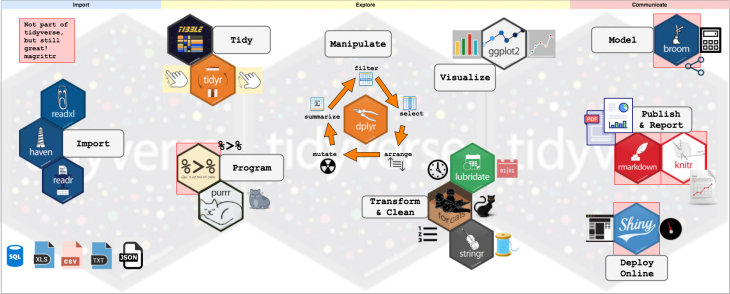
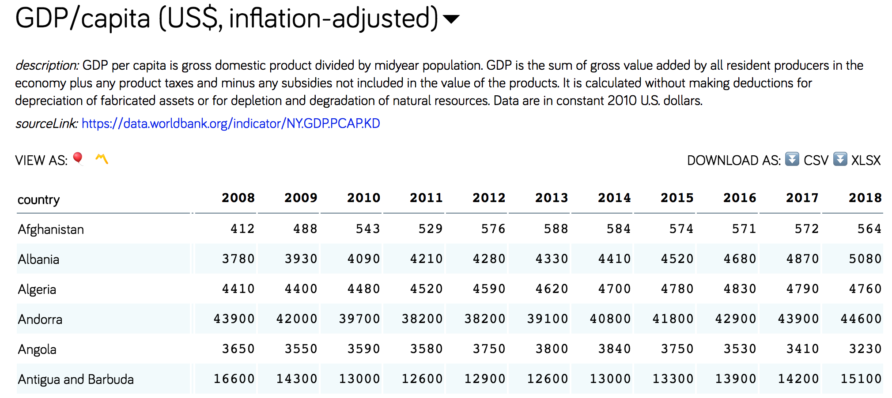

## Inspiration and Inception {#intro}

The [tidyverse](https://www.tidyverse.org/packages/) is a set of actively developed and well-maintained R packages to facilitate the typical data analysis workflow. Most but not all of the core tidyverse packages (there are now 8) were designed by [Hadley Wickham](http://hadley.nz/), chief scientist at RStudio since 2013. His book _[R for Data Science](https://r4ds.had.co.nz/)_ is an incredible resource that is only roughly summarized in this tutorial as it's clicked and helped me in my own work. 

<!-- Plenty of his talks and interviews are available on YouTube as well; [here's](https://www.youtube.com/watch?v=9YTNYT1maa4) my favorite from the [VIZBI](https://vizbi.org/) conference at EMBL last year.  -->

Many R programmers who don't explicitly know what the tidyverse is have at least used `ggplot2`, and if they got their start in base R as I did, probably found it annoying because of the slightly different syntax. The inspiration behind it was to be the first open source implementation of _[The Grammar of Graphics](https://towardsdatascience.com/a-comprehensive-guide-to-the-grammar-of-graphics-for-effective-visualization-of-multi-dimensional-1f92b4ed4149)_ (hence **gg**plot), a statistical textbook from the 1980s that provided a unique way to describe a range of data visualizations succinctly. Hence, `ggplot2` is a graphical language embedded in a programming language.

Grammar is simply an attribute of language that dictates how elements must be expressed in order to be coherent, and where human languages predominately evolve the grammar that distinguishes them functionally, programming languages are, well, programmed. Traditionally, points in X-Y space are called a scatterplot, but in `ggplot2` the same visual elements (a `geom_point()` + two axes) can be the basis of both scatterplots and boxplots - what differs is whether one axis is categorical or not.

The mission of `ggplot` - getting from data to visualization more intuitively by tweaking the grammar - is what paved the way for the rest of the tidyverse. R users who have ever melted or cast a data frame might be curious to know that those packages were also Hadley's work and key milestones of the `dplyr` package in the mature tidyverse. As he puts it, very often the key to creating a visualization is about getting the data in the right form, hence the expansion into data manipulation packages.

<center>

Canonical data science workflow from _R for Data Science_ [chapter 1](https://r4ds.had.co.nz/tidy-data.html)
</center><br>

I like this representation because it contains all the tasks I do as a computational researcher. Regardless of the motivating question, my work starts with data and ends with communicating something learned from the nonlinear process of exploring that data. The tidyverse attracted me because it offered complete workflow coverage and consistency throughout, which felt like the best way to attain fluency and proficiency. The documentation and community helps, too. Once I got into it, I realized that the weird syntax that kept me from liking `ggplot2` a few years ago is exactly what gives it those attractive qualities.

## Ecosystem {#pkgs}

Programming with the tidyverse is not that much like programming in base R, and I hope to make the case here that the tidyverse is not _better_ per se (although I clearly prefer it), but certainly more _coherent_ than the base R domain knowledge to carry out the same tasks. The tidyverse works because it consists of specialized entities (packages, functions) that share common concepts (syntax, structures) to help you flexibly adapt to different problems of varying complexity.

Here's an overview for your reference. In this post I will start with the very basics and mostly cover tidying and manipulating now, and programming with `purrr` later. In [this post](../tidyverse-covid-19) and [this post](../tidyverse-gut-diversity) I cover transforming, cleaning, and visualizing. 

<center>

<small>Photo taken from [_Getting Started with tidyverse in R_](https://www.storybench.org/getting-started-with-tidyverse-in-r/)</small>
</center><br>

To dive into the core packages and functions, let's load everyone's least favorite dataset: **mtcars**. It's a data frame.

```{r knitr, include = FALSE}
knitr::opts_chunk$set(message = FALSE, warning = FALSE)
```

```{r load.mtcars}
data(mtcars)
head(mtcars)
```

Let's transform it to a [tibble](https://tibble.tidyverse.org/) and see if you can spot the differences.

```{r as.tibble}
library(tibble)
as_tibble(mtcars)
```

### Tibbles {#tibble}

Three things should stand out: our rownames are missing, the data type of each column is now displayed in the console, and the full dimensions of the data are printed. A bit subtler is that the first 10 rows were automatically displayed without us needing to call `head()`. If you're following along in your own R console or R Notebook, there will be stylistic changes too.

Aside from the lack of rownames, which is a philosophy choice of the tidyverse I will get back to shortly, the other changes are upgrades to the data frame in my opinion. I frequently need to peek at my data structures in the console when I'm programming, and always hated having to type e.g. `head()` or `dim()` to get information I needed to proceed. I also frequently find out that a bug I'm having is because my column variables are encoded differently than I thought (e.g. an integer rather than a factor). Seeing these attributes of my variables in a tibble without needing to explicitly check for them forces me to confront potential issues early on.

The best programmers are the laziest programmers. Someone said that to me once and it stuck; you can only be lazy if you're good at what you do.

What's even better, 99 times out of 100 any function in R that accepts a data frame as an argument will accept a tibble as is without you needing to explicitly use `as.data.frame()` on it. That's because a tibble is of class `data.frame` as well.

```{r tibble.df}
class(as_tibble(mtcars))
```

On a practical level, what differentiates tibbles from data frames and a matrices is that **tibbles cannot have rownames.** That may seem silly, but it's actually really smart. Including e.g. "SampleID" and treating it as any other column doesn't really have downsides, but it has the huge upside of never having to call `rownames()` when coding. The rowname is after all just another variable describing the data - why not treat it as such structurally.

Importantly, as the code chunk above confirms, **tibbles are _not_ equivalent to numeric matrices**, and need to undergo a few transformations before applying functions that require numeric matrices. This is frequently the case in my little biostatistics niche.

That's definitely a downside, but it's one the package is aware of. There are two **key methods for interconverting between data frames/matrices and tibbles** that I use all the time: one for converting a data frame to a tibble so I can explore it (`rownames_to_column()`), and another for converting a tibble I've been working with to a data frame in order to apply an external function (`column_to_rownames()`). 

```{r}
# convert data frame with rownames (mtcars) to tibble
as_tibble(rownames_to_column(mtcars, var = 'model'))

# convert tibble to matrix with rownames;
mtcars.tbl <- as_tibble(rownames_to_column(mtcars, var = 'model'))
head(as.matrix(column_to_rownames(mtcars.tbl, var = 'model')))
```

If you're thinking, "I thought she said the tidyverse would _save_ time not _add_ steps" - it's about the long game, and ultimately, typing two lines to get my data into a tibble first has been _way_ more efficient than repeatedly questioning my data structure (literally, by asking it `dim()` or `head()` or `class(df$column)`) throughout an exploratory analysis/tidying session. I worked exclusively in base R for my MSc thesis and remember being truly enraged for a tiny second each time I accidentally just typed a variable name and watched a huge matrix print to the console - erasing my thought process and forcing me to _retype_ along with the right modifier. 

### Pipes {#magrittr}

One of the weirdest things about the tidyverse that probably deters beginners, as it did me, is its use of the **pipe** `%>%` operator. Bioinformaticians coming from other scripting and shell languages might be more comfortable thinking flexibly about operators, but it was pretty foreign to me, even as someone with a formal (albeit distantly so) programming background. I didn't know any off the top of my head except `<-` and `=`.

The intent of the pipe is to **make code more readable,** almost like a recipe. Remember, the whole idea of _The Grammar of Graphics_ was to break a data visualization down into raw ingredients, and this same recipe mentality is present in the `ggplot2` implementation that combines these ingredients in a structured, stepwise way using the `+` operator. The pipe however comes from the [magrittr](https://magrittr.tidyverse.org/) package, but it functions much the same by 'piping' the product of a function or calculation forward to another one. 

From our above example interconverting between data frames and tibbles, here's how the pipe operator would execute the same command:

```{r, }
library(magrittr)

mtcars.tbl <- mtcars %>%
    rownames_to_column(var = 'model') %>%
    as_tibble()
```

This is the most general way the pipe is used (but not the only one); the first line is always the variable you wish to create, followed by the variable you're starting with, followed by the `%>%` operator. In our example, `mtcars` is fed into `rownames_to_column()` which doesn't need us to explicitly give `mtcars` as a first argument anymore - same with `as_tibble()`. 

In my opinion, this is not only easier to read but also a lot less frustrating when working in the console. I suspect the tidyverse developers work on Macs and aren't used to having a home/end/insert key, because cursoring around to add parentheses and whatnot without those three keys was the bane of my R existence before I started using pipes.

Its use extends far beyond the tidyverse: the pipe operator and 'piping' works for base R commands (like `nrow()`, provided it's the end command in your pipe) and functions from specialized packages that read data frames, too. 

Here are two equivalent expressions calculating a Spearman correlation matrix from `mtcars`.

```{r}
cor.mat <- cor(mtcars, method = 'spearman')

cor.mat <- mtcars %>%
    cor(method = 'spearman')
```

The pipe actually makes the code _longer_, but what about the next step? What if we don't care at all about the actual correlation matrix and just want to plot it? 

```{r, fig.show = 'hide'}
# nested function calls
cor.plot <- corrplot::corrplot(cor(mtcars, method = 'spearman'))

# intermediate variable stored
cor.mat <- cor(mtcars, method = 'spearman')
cor.plot <- corrplot::corrplot(cor.mat)

# cleanest expression
cor.plot <- mtcars %>%
    cor(method = 'spearman') %>%
    corrplot::corrplot()
```

There's a way to pipe to functions that ask for a data frame as the second or third argument, or only want a specific column of your data frame. That is slightly advanced though and I will table it for later along with the `purrr` package and formula shortcuts. 

Hopefully you get the potential, but the real value of the pipe only became clearer to me the more intricate my manipulations and data structures became. I use them pretty exclusively in both my quick and dirty console programming and my polished scripts, and will continue to point out their utility to me. 

Straight from the documentation, it makes code more readable by:

- structuring sequences of data operations left-to-right (as opposed to from the inside and out),
- avoiding nested function calls,
- minimizing the need for local variables and function definitions, and
- making it easy to add steps anywhere in the sequence of operations.

It even has a series of ['aliases'](https://magrittr.tidyverse.org/reference/aliases.html) to do common data frame calculations and manipulations (like accessing a specific column), and some that work for subsetting and inserting into lists, too (again, to come later with `purrr`). 

### Tidying {#tidyr}

The pipe really shines during the manipulation of raw data into a format that invites further analysis. The core `tidyverse` packages for carrying this out are [tidyr](https://tidyr.tidyverse.org/) and [dplyr](https://dplyr.tidyverse.org/). So what does tidy data refer to, exactly?

It's a standard format that follows from the basic data structure of the tidyverse, a tibble, in which **1)** every column is a variable, **2)** every row is an observation, and **3)** every cell is a single value. Rownames, then, are not tidy; aside from that, the `mtcars` data fulfills the other criteria. Here is a visual representation of tidy data.

<center>

from _R for Data Science_ [chapter 12](https://r4ds.had.co.nz/tidy-data.html)
</center><br>

I'm going to switch gears now and look at the [gapminder data](https://www.gapminder.org/data/), which contains several per-country longitudinal metrics, shown below in an _untidy_ format. There are three variables contained in the table pictured below: country name, year, and inflation-adjusted GDP per capita, but these are spread across the rownames, column names, and values, respectively. 

<center>

</center></br>

Quickly, we'll use the existing gapminder [R package](https://github.com/jennybc/gapminder) just to see how this same data looks tidied.

```{r gapminder.show}
library(tidyr)
library(gapminder)

gapminder %>%
    dplyr::select(c('country','year','gdpPercap'))
```


Tidyr has **two workhorse functions when it comes to tidying data**: `pivot_longer()` and `pivot_wider()`, [formerly known as](https://github.com/tidyverse/tidyr/releases/tag/v1.0.0) as `gather()` and `spread()` respectively, or, as I mentioned earlier, `melt()` and `cast()` to some. Don't get too caught up in the syntax yet, but here's an animation of these functions in action from the [tidyexplain](https://github.com/gadenbuie/tidyexplain) package.

<center>

</center></br>

`pivot_longer()` _lengthens_ data and increases the number of rows, allowing us to "gather" our column name values into a column of its own and assigning a key-value pair, and is useful when a variable is stored in column names as is the case with the `gapminder` data. `pivot_wider()` _widens_ data and increases the number of columns, allowing us to "spread" the values in a single column across new columns. 

Let's take the long, tidy `gapminder` data above and pivot it wider into an untidy format, which could have its uses.

```{r gapminder.untidy}
gapminder.wide <- gapminder %>%
    dplyr::select(c('country','year','gdpPercap')) %>%
    pivot_wider(names_from = 'year', 
                values_from = 'gdpPercap') %>%
    print()
```

Now it looks like our image above. Let's pretend that `gapminder.wide` is our raw data and we need to tidy it. We'll use `pivot_longer()` this time, telling it to ignore the country (`cols = -country`), and gather the other column names into a variable called 'year', and the corresponding values into a variable called 'gpdPercap'. We didn't have to tell `pivot_wider()` to ignore any variables/columns, because our starting `gapminder.long` data only had three variables.

```{r gapminder.tidy}
gapminder.long <- gapminder.wide %>%
    pivot_longer(cols = -country,
                 names_to = 'year',
                 values_to = 'gdpPercap') %>%
    print()
```


### Wrangling {#dplyr}

Once the data is tidied, the `dplyr` package becomes essential to "wrangle" it further. Like `ggplot2`, `dplyr` is a _grammar_ of data manipulation. Practically what this means is that the functions and corresponding parameter names are intended to help you translate your thoughts into code more quickly, and vice versa. 

The basic function are as follows:

- `mutate()` adds new variables (columns) that are functions of existing variables 
- `select()` picks variables (columns) based on their names
- `filter()` picks cases (rows) based on their values
- `summarise()` reduces multiple values down to a single summary
- `arrange()` changes the ordering of the rows 

As these are such common data manipulations, they of course have [base R equivalents](https://tavareshugo.github.io/data_carpentry_extras/base-r_tidyverse_equivalents/base-r_tidyverse_equivalents.html), like much of the `dplyr` package. To be totally honest, aside from `subset()` (equivalent to `filter()`) and `sort()`/`order()` (equivalent to `arrange()`), I never used any of these. `subset()` has the exact same syntax as `filter()`, and I'm not going to argue that there are specific advantages to using `dplyr` if you're already a pro at base R manipulations. 

I wasn't, and personally found having a **dedicated and flexible package to master** for this purpose incredibly beneficial. The basic functions above were intuitive enough to learn and deploy quickly, and each time I encounted a specific problem wrangling my data I was able to find a clean solution by reading the [documentation]() or studying the [cheetsheat](), which over time I incorporated into my toolbox as well. 

Let's dive into some of these, switching back to `mtcars`. If we look at our `mtcars.tbl` again, we can see that some of the columns are 'dbl' when they should actually be factors ('fctr'). This has to do with tibbles being 'lazy', i.e. they do not guess data types and encode variables as either character or numeric whenever possible.

```{r}
mtcars.tbl
```

```{r}
library(dplyr)

mtcars.tbl %>%
    mutate(cyl = as.factor(cyl))
```

That's great, but I can see that the last four columns could all be factors as well and I don't want to do it for each column. `select()`, and all the other basic `dplyr` functions above provide extremely helpful [variants](https://dplyr.tidyverse.org/reference/scoped.html) to this effect. 

Adding the `_at()` suffix to any of the basic commands above allows me to specify column names or indices to manipulate multiple columns at once, while the `_all()` suffix allows me to manipulate all columns (in which case I need to pay attention to types and make sure what I'm doing will work for all columns). Lastly, the `_if()` suffix allows me to specify a logical (TRUE/FALSE output) function or condition to selectively affect columns. 

To get an idea of the scope of the categorical variables in `mtcars.tbl`, we'll first `mutate()` the variables we suspect are factors by name, then we'll `select()` only those columns, and finally we will `summarize()` each factor variable and compress all of our observations into a summary statistic, `nlevels`.

```{r}
mtcars.tbl %>% 
    mutate_at(c('cyl','vs','am','gear','carb'), as.factor) %>%
    select_if(is.factor) %>%
    summarize_all(nlevels)
```

The last two basic functions are `filter()` and `arrange()`. To introduce those with a very practical question, what if I'm only curious about the mileage for cars with 8 cylinders and 3 gears? We can start with our `mtcars.tbl` without converting any of the factors. We'll `filter()` according to `cyl`, and then `arrange()` our data by `mpg` in `desc`ending order. 

In the last line of code there is a nice subtlty of the `dplyr` syntax: earlier when we used `select()` we specified our column names as character vector, but it also works with the variable names directly as shown here.

```{r}
mtcars.tbl %>%
    filter(cyl == 8 & gear == 3) %>%
    arrange(desc(mpg)) %>% 
    select(model, cyl, gear, everything())
```

The last thing about `dplyr` that I think is really worth mentioning is the `group_by()` function, which is similar to `aggregate()` in base R and allows us to group our rows by any variable we like. If we told it to group by a continuous variable such as mpg, it would essentially call `unique(mpg)` and create a separate group for each. 

To use a practical example though, let's say we want the average mpg broken down by the number of cylinders. First we'll `select()` both columns, then `group` our rows `_by(cyl)` before we `summarize(mpg)`, which will respect our groups. If we removed the `group_by()` command, we would get a single summary statistic of _all_ rows - the average `mpg` of all data regardless of `cyl`.  

```{r}
mtcars.tbl %>%
    select(cyl, mpg) %>%
    group_by(cyl) %>%
    summarize(avg.mpg = mean(mpg))
```

Another syntax subtlety to point out: when we used the `_all()` variant of the `summarize()` function earlier, we only had to give the name of the summary function, but with the basic `summarize()` function here, we had to specify inside of the function which columns we wanted to summarize. We could have also written `summarize(mean(mpg))` and the `avg.mpg` column would read `mean(mpg)` instead but hold the same values.

### Nesting {#nesting}

`group_by()` is really handy - but what if I want to incorporate the `avg.mpg` as a new column in `mtcars.tbl` instead of just extracting or peeking at the values as we did above? Enter `nest()` from `tidyr`, which will create a **list-column**, i.e. a column of our tibble that is actually a list. 

Here's what that looks like with `mtcars.tbl` if we split the data into groups according to `cyl` again.

```{r}
mtcars.tbl %>%
    nest(data = -cyl)
```

Peeking at the data we just nested, i.e. the 3rd tibble in our new list-column, will give us all the corresponding variables for car models with 8 cylinders.

```{r}
mtcars.nest <- mtcars.tbl %>%
    nest(data = -cyl)

mtcars.nest$data[[3]]
```

Whereas the `summarize()` function _transformed_ our data, `nest()` _restructured_ our data. You could generalize this to the package level and say that `dplyr` primarily transforms and `tidyr` primarily restructures. Of course, we still need to transform it in order to get the average mpg, but I want to pause here and discuss why one would want to restructure their data, in case it's not immediately obvious. 

First, especially since it's a tidyverse function and therefore built to work with tibbles, nesting is a super **visually appealing and an easy way to get specific peeks into your data**. This would be the basic use case. We can quickly see the number of observations/rows associated with our grouping variable, since the dimensions of the tibble are displayed, without having to calculate that specifically or save the nested structure. 

More importantly though, **nesting and list-columns are somewhat of a portal within the tidyverse**. Up until `nest()`, we had been working with a single data structure: a tibble, a data frame. A familiar and incredibly handy structure made up of rows, columns and values that we know how to work with. A data frame combines both of R's two fundamental data types in that it is a **list** of **vectors** (which all have the same length). That's why we can call `as.list()` on `mtcars` with no problem.

```{r}
mtcars %>%
    as.list() %>%
    head()
```

A matrix on the other hand is _not_ a list of vectors, but a two-dimensional vector, which is why it must be of the same atomic type (character, numeric, logical). We can convert `mtcars` to a matrix since all of the values are actually numeric, but when we then go to convert the matrix to a list, we lose track of our columns.

```{r}
mtcars %>%
    as.matrix() %>%
    as.list() %>%
    head()
```

The main advantage of a list is that it can store _any_ type of object - models, plots, matrices, data frames, or other lists, but they can quickly become overwhelming to work with or explore. The reason nesting is so clever is because it **re-engineers the data frame**, which is easy to work with and keeps related things together well, to **incorporate the list's ability to store complex data types.** Furthermore, this is now the perfect structure for the tidyverse ecosystem: `dplyr` has already given us a complete toolbox for dealing with data frames, and later I will explore the `purrr` package for dealing with lists. Like I said, a portal.

<!-- This is why data frames can have variables that are numeric, character, and factor and a matrix cannot: its underlying data structure is not a list but a two-dimensional vector. -->

<!-- there are two basic data structures: vectors and lists. Vectors must be of the _same_ data type (i.e. numeric, character, or factor), but lists can hold _any_ data type. The reasons matrices and data frames behave differently in R is because a matrix is two-dimensional vector (still one data type), but a data frame in R is a actually a _list_ of vectors that are all the same length. -->

<!-- familiar and incredibly handy structure made up of rows, columns and values. In R, a data frame is distinct from a matrix because it can hold varibles of multiple data types. In other words, the values must be of one type in a matrix, but they can be characters, factors, and/or strings in a data frame as long as columns are consistent. -->

<!-- `tidyr` **standardized the data frame** such that all rows were observations and all columns were variables (and variables weren't spread across column or rownames), but it also **allows columns to be lists and values to be anything** - even another data frame (or a model, or an object, or a plot). This is the beauty of functional programming and the `purrr` package, and it's actually what brought me to adopt the tidyverse. It's absolutely brilliant because it **harnesses the advantages of both data frames and lists**. More on this to come in a more programming-heavy post. -->

<!-- For me this is a natural place to pause because the discovery of nested list-columns was the beginning of an exponential growth phase in my interest to program - a portal. While I do hope to make programming more accessible and intuitive to everyone reading this, I recognize the primary audience will likely be split between those using R to do somewhat cut-and-dry manipulations like we've done here (perhaps to achieve simple correlations or visualizations), and those using R to do more complex and custom manipulations like modeling and simulation, and I want to respect that delineation.  -->

<!-- As the name of this part of the tutorial suggests, much like a biological [ecosystem](#pkgs) the tidyverse works because while the entities (packages, functions) are specialized, they share common concepts (syntax, structures) that allow them to flexibly adapt to different problems (modeling, visualization). I hope those also working in biology can appreciate the metaphors as much as I do. -->

<!-- As the [workflow](#intro) in the introduction showed, exploratory data analysis is an iterative, nonlinear process. I have tried to introduce it in a linear fashion to emphasize the tools, but in reality few tasks are as simple as these. I and many others came to R to solve messy and complex biological problems that we don't know the answer to, which require many more transformations and use of specialized packages or functions to even get to better questions most of the time. While everything that's been introduced so far still facilitates that process to some degree in my opinion, it's literally the tip of the iceberg.  -->
<!-- When I started my PhD, I was tasked with eventually simulating multi-omics datasets. -->

To wrap up our `mtcars` example where we create and incorporate the `avg.mpg` variable into `mtcars.tbl` as a sneak peek, here's how that's done using `map_dbl()` from the `purrr` package, which maps a given function over every element in a list and returns a double which we've designated `avg.mpg`.

```{r}
mtcars.nest <- mtcars.tbl %>%
    nest(data = -cyl) %>%
    mutate(avg.mpg = purrr::map_dbl(data, ~ mean(.$mpg))) %>%
    print()
```

And of course, you can `unnest()`, which will fill in the same group `avg.mpg` for rows which share a `cyl` value.

```{r}
mtcars.nest %>%
    unnest(data) %>%
    select(model, avg.mpg, cyl, mpg)
```

### Functional Programming {#purrr}

Coming soon
<!-- 21.4 For loops vs. functionals -->
<!-- For loops are not as important in R as they are in other languages because R is a functional programming language. This means that it’s possible to wrap up for loops in a function, and call that function instead of using the for loop directly. -->


<!-- ### Strings and Factors {#stringr.forcats} -->

<!-- Coming soon -->
<!-- mutate_at -->
<!-- - stringr - str_detect with filter -->
<!-- - forcats for factors - useful before plotting -->
<!-- - ideal for working with two annoying data types -->

## TL;DR {#tldr}

The typical data analysis project is a set of interconnected steps - a workflow - and there are benefits to using programming as a tool throughout, including automation and reproducibility (it's easy to save and rerun code), as well as the ability to handle more difficult problems later on. For example, it can be a lot more efficient to use programming to solve plotting problems instead of Illustrator (with some practice).

R is an open source programming language already tailored to statistical analysis. Its base implementation enables extensive modeling and visualization, and thousands of specialized packages and niches have emerged on top of this (e.g. `phyloseq` for the microbiome community). The tidyverse is a large initiative to streamline the entire data analysis workflow by encompassing what comes before and after statistical analysis into a coherent set of packages.

It involves learning some new syntax, and some lingo. For light R users, simply investing in [tibbles](#tibble) and the [pipe](#magrittr) (`%>%`) operator will allow you to interact with your raw data in a less frustrating and error-prone manner and generate more readable code. Similarly, understanding even a little bit [how](#intro) `ggplot2` was structured might make working with it a bit more intuitive.

For those working extensively in R, committing to that as well as [tidy](#tidyr) data structures will make you a better, more curious programmer. Especially if you are self-taught, the tidyverse provides the quickest path to proficiency for data analysis in R, not only because it's clever and coherent but because it's got resources for days: the [documentation](https://tidyverse.tidyverse.org/) is immaculate, there are [cheatsheets](https://rstudio.com/resources/cheatsheets/) as well as [programming textbooks](https://rstudio.com/resources/books/) all freely available, plus an active developer and user community on GitHub and Stack Overflow. 

Mastery of the basics opens up a wealth of more advanced tools that I am excited to advocate for and explore in future posts, like deeply nested data structures and functional programming with the `purrr` package.

<!-- Among human languages one could reasonably posit that English is easier to learn than German, but German allows more precision in expression. Among programming languages, the tidyverse was designed to combine the simplicity of English syntax (literally) with the precision of German grammar (figuratively). -->

```{css, echo = FALSE}
img {
    display: block;
    margin-left: auto;
    margin-right: auto;
    width: 70%;
    padding: 10px
}
```
