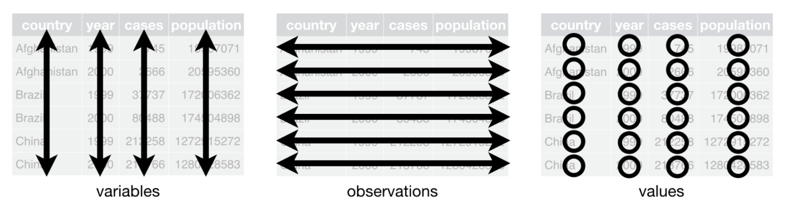

## Inspiration and Inception {#intro}

The [tidyverse](https://www.tidyverse.org/packages/) is a set of actively developed and well-maintained R packages to facilitate the typical data analysis workflow. Most but not all of the core tidyverse packages (there are now 8) were designed by [Hadley Wickham](http://hadley.nz/), chief scientist at RStudio since 2013. His book _[R for Data Science](https://r4ds.had.co.nz/)_ is an incredible resource that is only roughly summarized in this tutorial. Plenty of his talks and interviews are available on YouTube as well; [here's](https://www.youtube.com/watch?v=9YTNYT1maa4) my favorite from the [VIZBI](https://vizbi.org/) conference at EMBL last year. 

Many R programmers who don't explicitly know what the tidyverse is have at least used `ggplot2`, and if they got their start in base R as I did, probably found it annoying because of the slightly different syntax. The inspiration behind it was to be the first open source implementation of _[The Grammar of Graphics](https://towardsdatascience.com/a-comprehensive-guide-to-the-grammar-of-graphics-for-effective-visualization-of-multi-dimensional-1f92b4ed4149)_ (hence **gg**plot), a statistical textbook from the 1980s that provided a concise way to describe a range of data visualizations. Grammar is simply an attribute of language that dictates how elements must be expressed in order to be understood, and where human languages predominately evolve the grammar that distinguishes them functionally, programming languages can be tailored and tweaked. 

The mission of `ggplot` - getting from data to visualization more intuitively by tweaking the grammar - is what paved the way for the rest of the tidyverse. R users who have ever melted or cast a data frame might be curious to know that those packages were also Hadley's work and key milestones of the `dplyr` package in the mature tidyverse. As he puts it, very often the key to creating a visualization is about getting the data in the right form, hence the expansion into data manipulation.

<center>

Canonical data science workflow from _R for Data Science_ [chapter 1](https://r4ds.had.co.nz/tidy-data.html)
</center><br>

I like this representation because it contains all the tasks I do as a computational researcher. Regardless of the motivating question, my work starts with data and ends with communicating something learned from the nonlinear process of exploring that data. The tidyverse attracted me because it offered complete workflow coverage and consistency throughout, which felt like the best way to attain fluency and proficiency. Once I got into it, I realized that the weird syntax that kept me from liking `ggplot2` a few years ago is exactly what gives it those attractive qualities.

## Features and Demo

To show my favorite features, let's load everyone's least favorite dataset: **mtcars**. It's a data frame.

```{r load.mtcars}
data(mtcars)
head(mtcars)
```

Let's transform it to a [tibble](https://tibble.tidyverse.org/) and see if you can spot the differences.

```{r as.tibble}
library(tibble)
as_tibble(mtcars)
```

### Tibbles {#tibbles}

Three things should stand out: our rownames are missing, the data type of each column is now displayed in the console, and the full dimensions of the data are printed. A bit subtler is that the first 10 rows were automatically displayed without us needing to call `head()`. If you're following along in your own R console or R Notebook, there will be stylistic changes too.

Aside from the lack of rownames, which is a philosophy choice of the tidyverse I will get back to shortly, the other changes are upgrades to the data frame in my opinion. I frequently need to peek at my data structures in the console when I'm programming, and always hated having to type e.g. `head()` or `dim()` to get information I needed to proceed. I also frequently find out that a bug I'm having is because my column variables are encoded differently than I thought (e.g. an integer rather than a factor). Seeing these attributes of my variables in a tibble without needing to explicitly check for them forces me to confront potential issues early on.

The best programmers are the laziest programmers. Someone said that to me once and it stuck; you can only be lazy if you're good at what you do.

What's even better, 99 times out of 100 any function in R that accepts a data frame as an argument will accept a tibble as is without you needing to explicitly use `as.data.frame()` on it. That's because a tibble is of class `data.frame` as well.

```{r tibble.df}
class(as_tibble(mtcars))
```

On a data structural level, what differentiates tibbles from data frames and a matrices is that **tibbles cannot have rownames.** That may seem silly, but it's actually really smart. Including e.g. "SampleID" and treating it as any other column doesn't really have downsides, but it has the huge upside of never having to call `rownames()` when coding. The rowname is after all just another variable describing the data - why not treat it as such structurally.

Importantly, as the code chunk above confirms,  **tibbles are _not_ equivalent to numeric matrices**, and need to undergo a few transformations before applying functions that require numeric matrices. This is frequently the case in my little biostatistics niche and would reasonably be considered a downside for most (including former me).

The package is aware that many existing R functions work with rownames and/or matrices. There are two **key methods for interconverting between data frames/matrices and tibbles** that I use all the time: one for converting a data frame to a tibble so I can explore it (`rownames_to_column()`), and another for converting a tibble I've been working with to a data frame in order to apply an external function (`column_to_rownames()`). 

```{r}
# convert data frame with rownames (mtcars) to tibble
as_tibble(rownames_to_column(mtcars, var = 'model'))

# convert tibble to matrix with rownames;
mtcars.tbl <- as_tibble(rownames_to_column(mtcars, var = 'model'))
head(as.matrix(column_to_rownames(mtcars.tbl, var = 'model')))
```

If you're thinking, "I thought she said the tidyverse would _save_ time not _add_ steps" - it's about the long game, and ultimately, typing two lines to get my data into a tibble first has been more efficient than repeatedly questioning my data structure (literally, by asking it `dim()` or `head()` or `class(df$column)`) throughout an exploratory analysis/tidying session. I worked exclusively in base R for my MSc thesis and remember being truly enraged for a tiny second each time I accidentally just typed a variable name and watched a huge matrix print to the console - erasing my thought process and forcing me to _retype_ along with the right modifier. 

### Pipes {#pipes}

One of the weirdest things about the tidyverse that probably deters beginners, as it did me, is its use of the **pipe** `%>%` operator. Bioinformaticians coming from other scripting and shell languages might be more comfortable thinking flexibly about operators, but it was pretty foreign to me, even as someone with a formal (albeit distantly so) programming background. I didn't know any off the top of my head except `<-` and `=`.

The intent of the pipe is to **make code more readable,** almost like a recipe. Remember, the whole idea of _The Grammar of Graphics_ was to break a data visualization down into raw ingredients, and this same recipe mentality is present in the `ggplot2` implementation that combines these ingredients in a structured, stepwise way using the `+` operator. The pipe however comes from the [magrittr](https://magrittr.tidyverse.org/) package, but it functions much the same by 'piping' the product of a function or calculation forward to another one. 

From our above example interconverting between data frames and tibbles, here's how the pipe operator would execute the same command:

```{r, }
mtcars.tbl <- mtcars %>%
    rownames_to_column(var = 'model') %>%
    as_tibble()
```

This is the most general way the pipe is used (but not the only one); the first line is always the variable you wish to create followed by what you're starting with followed by the `%>%` operator. In our example, `mtcars` is fed into `rownames_to_column()` which doesn't need us to explicitly give `mtcars` as a first argument anymore - same with `as_tibble()`. 

In my opinion, this is not only easier to read but also a lot less frustrating when working in the console. I suspect the tidyverse developers work on Macs and aren't used to having a home/end/insert key, because cursoring around to add parentheses and whatnot without those three keys was the bane of my R existence before I started using pipes.

Importantly, **the pipe only works with tibbles and data frames**, not matrices (hence why we did have to call `as.matrix()` a few code chunks ago), but its use extends far beyond the tidyverse: the pipe operator and 'piping' works for base R commands (like `nrow()`, provided it's the end command in your pipe) and functions from specialized packages that read data frames, too. 

Here are two equivalent expressions calculating a Spearman correlation matrix from `mtcars`.

```{r}
cor.mat <- cor(mtcars, method = 'spearman')

cor.mat <- mtcars %>%
    cor(method = 'spearman')
```

The pipe actually makes the code _longer_, but what about the next step? What if we don't care at all about the actual correlation matrix and just want to plot it? 

```{r, fig.show = 'hide'}
# nested function calls
cor.plot <- corrplot::corrplot(cor(mtcars, method = 'spearman'))

# intermediate variable stored
cor.mat <- cor(mtcars, method = 'spearman')
cor.plot <- corrplot::corrplot(cor.mat)

# cleanest expression
cor.plot <- mtcars %>%
    cor(method = 'spearman') %>%
    corrplot::corrplot()
```

There's a way to pipe to functions that ask for a data frame as the second or third argument, or only want a specific column of your data frame. That is slightly advanced though and I will table it for later along with the `purrr` package and formula shortcuts. 

Hopefully you get the potential, but the real value of the pipe only became clearer to me the more intricate my manipulations and data structures became. I use them pretty exclusively in both my quick and dirty console programming and my polished scripts, and will continue to point out their utility to me. 

Straight from the documentation, it makes code more readable by:

- structuring sequences of data operations left-to-right (as opposed to from the inside and out),
- avoiding nested function calls,
- minimizing the need for local variables and function definitions, and
- making it easy to add steps anywhere in the sequence of operations.

It even has a series of ['aliases'](https://magrittr.tidyverse.org/reference/aliases.html) to do common data frame calculations and manipulations (like accessing a specific column), and some that work for subsetting and inserting into lists, too (again, to come later with `purrr`). At this point, I'll go ahead and admit that I employ `use_series()` instead of `$` and `extract2()` instead of `[[]]` 9 times out of 10 just because I find pipes so much better than typical R code. It's a stylistic choice, and there are definitely times to use it and times it's fine without.

### Tidying and Wrangling

Where the pipe really shines is during the process of data wrangling, i.e. manipulating the raw data into a format that invites further analysis. The two main packages for carrying this out are [tidyr](https://tidyr.tidyverse.org/) and [dplyr](https://dplyr.tidyverse.org/). 

Now is finally the time to spell out what tidy data actually is.

It's a standard format that follows from the basic data structure of the tidyverse, a tibble, in which every column is a variable, every row is an observation, and every cell is a single value. Rownames, then, are not tidy. Aside from this, the `mtcars` data fulfills the other criteria.

<center>

from _R for Data Science_ [chapter 12](https://r4ds.had.co.nz/tidy-data.html)
</center><br>


```{r knitr, include = FALSE}
knitr::opts_chunk$set(message = FALSE, warning = FALSE)
```

<!-- do a distance matrix? or copy some work from gespic -->
<!-- - dplyr and tidyr -->
<!-- - gather and spread -->
<!-- - nesting and summarizing -->
<!-- mutate -->

### Strings and Factors

Coming soon
<!-- mtuate_at -->
<!-- - stringr - str_detect with filter -->
<!-- - forcats for factors - useful before plotting -->
<!-- - ideal for working with two annoying data types -->

## TL;DR

The typical data analysis project is a set of interconnected steps - a workflow - and there are benefits to using programming as a tool throughout, including automation and reproducibility (it's easy to save and rerun code), as well as the ability to handle more difficult problems later on. For example, it can be a lot more efficient to use programming to solve plotting problems instead of Illustrator (with some practice).

R is an open source programming language already tailored to statistical analysis. Its base implementation enables extensive modelling and visualization, and thousands of specialized packages and niches have emerged on top of this (e.g. `phyloseq` for the microbiome community). The tidyverse is a large initiative to streamline the entire data analysis workflow by encompassing what comes before and after statistical analysis into a coherent set of packages. 

It involves learning some new syntax, and some lingo. For light R users, simply investing in [tibbles](#tibbles) and the [pipe](#pipes) (`%>%`) operator will allow you to interact with your raw data in a less frustrating and error-prone manner and generate more readable code. Similarly, understanding even a little bit [how](#intro) `ggplot2` was structured will make working with it more intuitive.

For those working extensively in R, committing to that as well as tidy data structures will make you a better, more curious programmer. Especially if you are self-taught, the tidyverse provides the quickest path to proficiency for data analysis in R, not only because it's clever but because it's got the most resources. The [documentation](https://tidyverse.tidyverse.org/) is immaculate, there are [cheatsheets](https://rstudio.com/resources/cheatsheets/) as well as [deeper programming resources](https://rstudio.com/resources/books/), plus an active community on GitHub and Stack Overflow. Mastery of the basics opens up a wealth of more advanced tools that I will advocate for and explore myself in future posts, like nested list-columns and the `purrr` package.

```{css, echo = FALSE}
img {
    display: block;
    margin-left: auto;
    margin-right: auto;
    width: 70%;
    padding: 10px
}
```